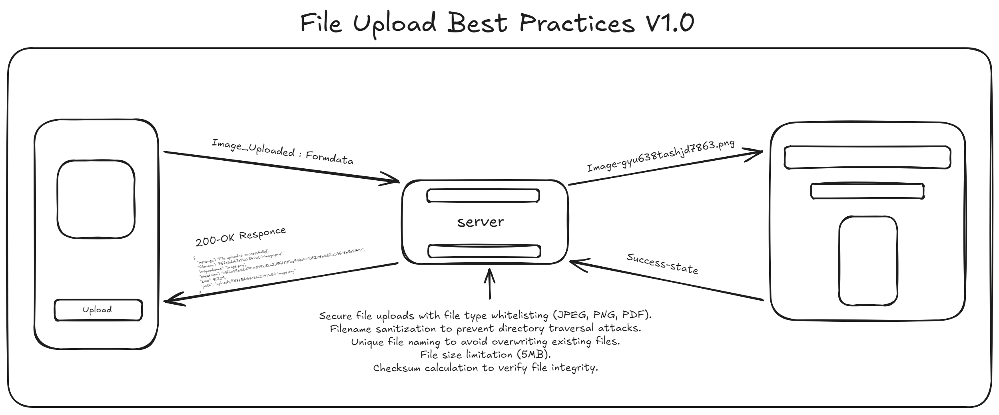

<h1 align="center">
  <br>
  <a href="#"></a>
  <br>
  File Upload Secuirty Best Practices  
  <br>
</h1>

<h4 align="center">Advanced ( 🔥 ) Advance File Upload Project V2.0</h4>  

<p align="center">
  <a href="#">
    
  </a>
  <a href="#">
    
  </a>
  <a href="#">
      
  </a>
</p>

# File Upload Best Practices for Node.js API Service 

This is a secure file upload API built using Node.js and Express, following best practices to handle file uploads with proper validation and security measures.

## Features
* Secure file uploads with file type whitelisting (JPEG, PNG, PDF).
* Filename sanitization to prevent directory traversal attacks.
* Prevent XSS attacks from payloads embedded in (PDF, SVG)
* Unique file naming to avoid overwriting existing files.
* File size limitation (5MB).
* Checksum calculation to verify file integrity.
* Uses local storage for file storage.

## Table of Contents

* Features
* Project Structure
* Prerequisites
* Installation
* Usage
* Testing the API
* Security Practices
* License


## Prerequisites
**Before running the application, ensure you have the following installed:**

* Node.js: JavaScript runtime environment
* Express.js: Web framework for Node.js


```bash
file-upload/
├── controllers/
│   └── fileController.js         # Handles file upload logic
├── middleware/
│   └── fileUpload.js             # Multer configuration and validation logic
├── payloads/
│   └── batman.pdf                # XSS payload embedded pdf file for testing purpose
│   └── xss-image.svg             # SVG XSS payload embedded file for testing purpose
├── routes/
│   └── fileRoutes.js             # API routes
├── services/
│   └── fileService.js            # File-related services (checksum calculation)
├── uploads/                      # Directory for storing uploaded files
├── utils/
│   └── checksum.js               # Utility to calculate checksum (optional)
├── app.js                        # Main application entry point
├── package.json                  # Dependencies and scripts
└── .gitignore                    # Ignoring unnecessary files (like node_modules)
```

## Installation

**Clone the repository:**
```bash
git clone https://github.com/Narayanan-info/File_Upload.git
cd File_Upload
```
**Install dependencies:**

```bash
npm install
```
**Create the uploads/ directory for storing uploaded files:**

```bash
mkdir uploads
```
**Start the application:**

```bash
node app.js
```

* The server will be running at `http://localhost:3000.`

## Usage

**POST**`/api/upload`

This API endpoint allows users to upload files securely. Only `JPEG`, `PNG`, and `PDF` files are accepted. The maximum file size allowed is `5MB`.

**Request Body:**
* file: The file to be uploaded (as `form-data`).

**Example using Postman:**

1. Select POST method.
2. URL: `http://localhost:3000/api/upload`
3. Go to the Body tab and choose form-data.
4. Add a key `file` and upload a file (e.g., `.jpg`, `.png`, or `.pdf`).

* Response Example:

```bash
{
  "message": "File uploaded successfully!",
  "filename": "f67e5dcb7c13a2342a54-image.png",
  "originalname": "image.png",
  "checksum": "c9fbe85a8d9799e0192d2b2d5fd111fae544a9e43f226b8dfbe546c8b5e8ff9e",
  "size": 45329,
  "path": "uploads/f67e5dcb7c13a2342a54-image.png"
}

```

* Response Example For If The File Containe XSS Payloads:

```bash
{
    "error": "SVG contains embedded JavaScript, upload rejected."
}
```
## Testing the API
**To test the file upload API:**

1. Use Postman or cURL to upload files to the API.
2. Ensure the uploaded files are stored in the `uploads/` directory.

## Security Practices

**This project implements the following security practices for handling file uploads:**

1. File Type Whitelisting: Only allows specific file types (JPEG, PNG, PDF).
2. Filename Sanitization: Prevents directory traversal by sanitizing the uploaded file's name.
3. Unique File Naming: Each file is renamed with a unique identifier to prevent overwriting existing files.
4. File Size Limitation: Restricts uploads to a maximum size of 5MB.
5. Checksum Validation: A SHA-256 checksum is calculated for each uploaded file to ensure integrity.

## License

This project is licensed under the `MIT License`. See the **LICENSE** file for more details.